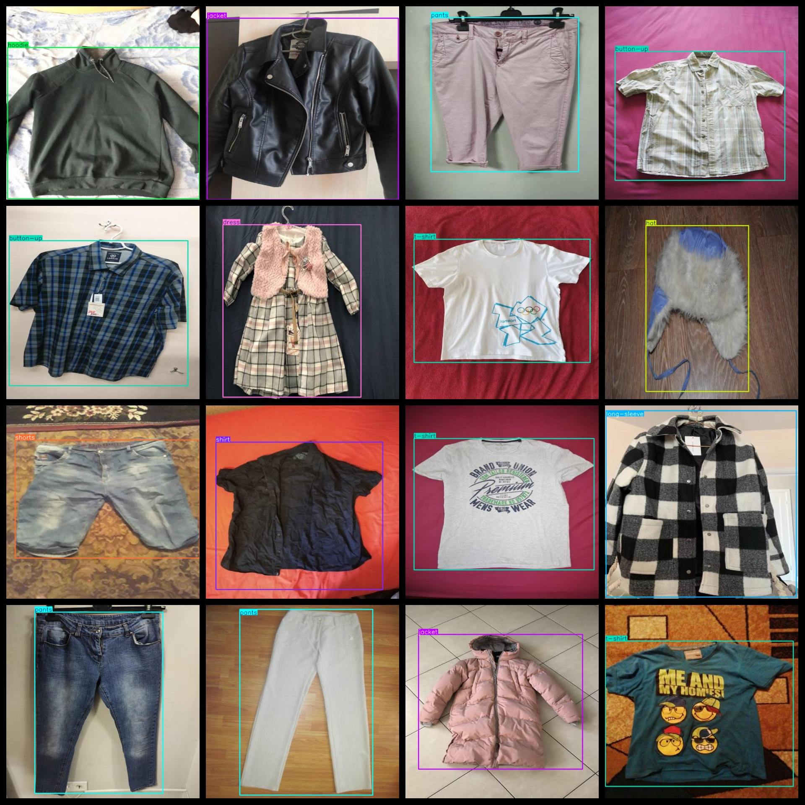
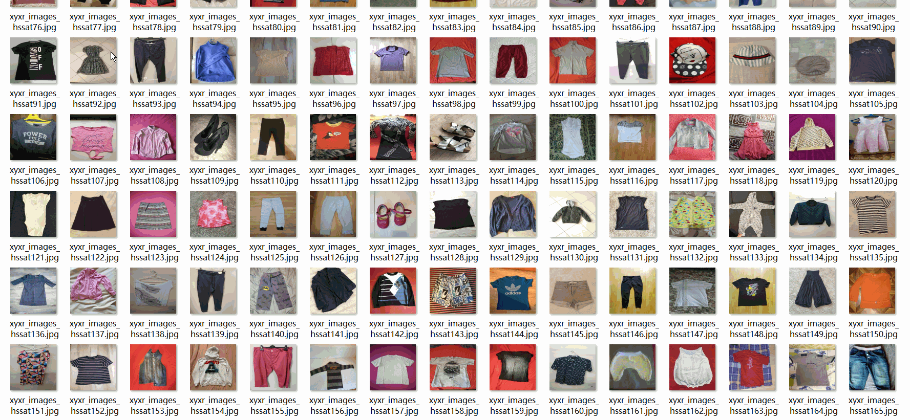

# Clothing Trousers etc Clothing Detection Dataset 2990 images28-classVOC+YOLO

Clothes Trousers and other clothing detection data set 2990 VOCs + YOLO

Dataset format: Pascal VOC format + YOLO format (the txt file does not contain the split path, it only contains jpg images and corresponding VOC format xml files and yolo format txt files)

Number of images (Total number of jpg files): 2990

Number of XML files: 2990

Number of txt files: 2990

Label count: 28

The Github repository is: datasets_sl

["baby-clothes", "blouse", "button up", "button-up", "crewneck", "dress", "gloves", "hat", "hoodie", "jacket", "long-sleeve", "overalls", "pants", "polo", "robe", "shirt", "shoes", "shorst", "shorts", "skirt", "sleeveless-jacket", "suit", "sweater", "t-shirt", "tank-top", "top", "vest", "zip-up jacket"]

Infant wear, Shirt, Knotted, Buttoned, Round-neck, Dress, Gloves, Hat, Hooded sweater, Jacket, Long sleeve, Workwear pants, Pants, Curling, Robe, Coat, Sleeveless jacket, Suits, Sweaters, T-shirts, Vests, Zip-up jacket

Number of boxes labeled in each category:

baby-clothes frame count = 76

【141】

The number of buttons is 1.

The number of button-up frames is 157.

crewneck frame count = 40

Dress frame count = 207

Gloves frame count = 1

The hat frame number is 104.

The hoodie frame count is 55.

Jacket Frame Count = 234

Long-sleeve count = 365

【】『』「」【】『』「」【】『』「」【】『』「」【】『』「」【】『』「」【】『』「」【】『』「」【】『』「」【】『』「」【】『』「」【】『』「」【】『』「」【】『』「」【】『』「」【】『』「」【】『』「」【】『』「」【】『』「」【】『』「」【】『』「」【】『』「」【】『』「」【】『』「」【】『』「」【】『』「」【】『』「」【】『』「」【】『』「」【】『』「」【】『』「」【】『』「」【】『』「」【】『』「」【】『』「」【】『』「」【】『』「」【】『』「」【】『』「」【】『』「」【】『』「」【】『』「」【】『』「」【】『』「」【】『』「」【】『』「」【】『』「」【】『』「」【】『』「」【】『』「」【】『』「」【】『』「」【】『』「」【】『』「」【】『』「」【】『』「」【】『』「」【】『』「」【】『』「」【】『』「」【】『』「」【】『』「」【】『』「」【】『』「」【】『』「」【】『』「」【】『』「」【】『』「」【】『』「」【】『』「」【】『』「」【】『』「」【】『』「」【】『』「」【】『』「」【】『』「」【】『』「」【】『』「」【】『』「」【】『』「」【】『』「」【】『』「」【】『』「」【】『』「」【】『』「」【】『』「」【】『』「」【】『』「」【】『』「」【】『』「」【】『』「」【】『』「」【】『』「」【】『』「」【】『』「」【】『』「」【】『』「」【】『』「」【】『』「」【']

Pants frame count = 397

Polo Frames = 70

Robe frame count = 6

Shirt Frame Count = 245

shoes frame count = 378

Short Frame Number = 1

shorts frame count = 175

Skirt frame count = 59

sleeveless-jacket frame count = 26

Suit Frame Count = 21

sweater frame count = 69

The number of t-shirts is 389.

Tank-top frame count = 118

The number of top frames is 7.

The number of vest frames is 15.

【】['zip-up jacket', 'frame number = 1']

Total Frames: 3363

Number of images per category:

Baby-clothes occupies 76 pictures.

Blouse owns 138 images.

Button up count = 1

button-up occupies 157 images.

Crewneck occupies 38 images.

Dress Ownership Picture Count = 199

Gloves owning pictures = 1

The number of pictures owned = 103

Hoodie owns 55 pictures.

Jacket occupies 232 pictures.

Long-sleeve shirts have 352 photos.

Overalls occupies a picture count = 5

Pants occupies a total of 391 images.

Polo has 66 pictures.

Number of pictures owned by robe = 6

The number of shirts is 244.

Shoes occupies 260 images.

Short occupancy count = 1

Shorts's total number of photos = 173

Skirt occupies picture count = 58

Sleeveless-jacket occupies 26 pictures.

Suit possession count = 21

sweater annotated images = 68

T-shirts have 387 pictures.

tank-top annotated images = 115

Top occupied image count = 7

"Vest" occupies the image number = 15

Zip-up jacket has 1 picture.

Image resolution: 640x640

Use the labeling tool: labelImg

Dataset Augmentation: No

Rules for annotation: Draw a rectangle around the category.

Important note: The dataset does not have been divided into training, validation, and testing sets.

Special Disclaimer: This dataset does not guarantee the accuracy of the trained models or weight files.

Annotation and image details are as follows:

## Images

---

Here is a pay link on Stripe (https://buy.stripe.com/3cs8yP7sY87d0vu9AB). Please contact me lonlonago@foxmail.com after funding $89, and I will send you a complete data files, thank you!

